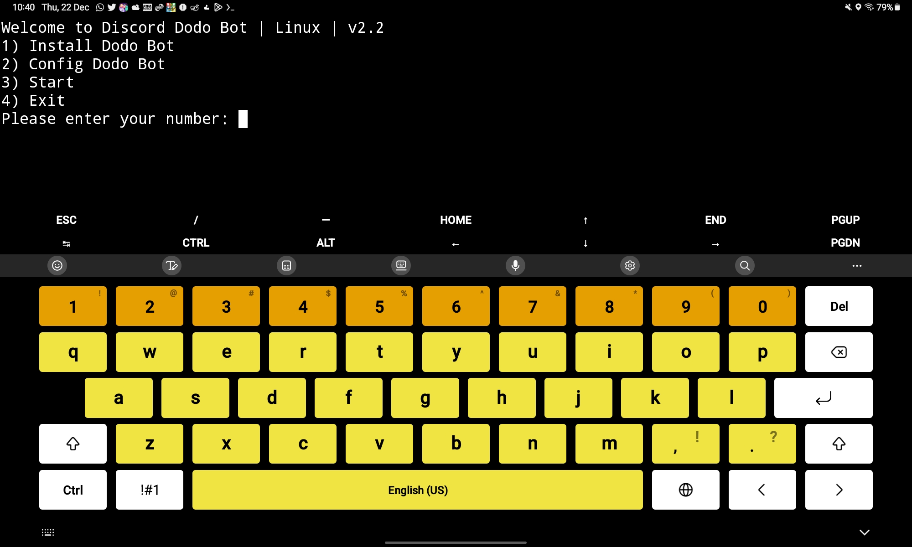

# Discord Dodo Bot on Linux 
Discord Dodo Bot Hosting on Linux

## Install
<details>
<summary><b>Install Linux & Android</summary>
  
```
wget https://raw.githubusercontent.com/InikoMatthewPro/discord-dodobot-on-linux/main/version/dodobot-v2.1 && sudo bash dodobot-v2
```
</details>
  
## Run
<details>
<summary><b>Run Linux (With sudo)</summary>
  
```
sudo bash discord-dodobot-v2.2
```
</details>
  
<details>
<summary><b>Run Linux (Without sudo)</summary>
  
```
bash discord-dodobot-v2.2
```
</details>
  
<details>
<summary><b>Eun Android (Termux + Without sudo)</summary>

```
bash discord-dodobot-v2.2
```
</details>

### New Features
- Easy to use
- 3x faster than cloud
- Supported Termux on Android
- Supported Ubuntu, Debian & Based-Debian
- Less power watts than cloud
- Its free
- Less cost than cloud
- Supported ARM & Intel

### Reviews

